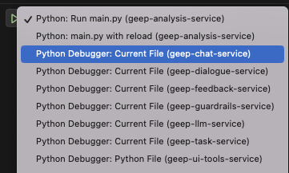
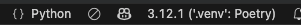

# GEEP Python Developer's Guide - Getting Started

## Table of Contents

- [Getting Started on a Project](#getting-started-on-a-project)
  - [Setting Up Your Python Environment](#setting-up-your-python-environment)
  - [1. Install prerequisites](#1-install-prerequisites)
  - [2. Install Python version](#2-install-python-version)
  - [3. Set the local Python version](#3-set-the-local-python-version)
  - [4. Poetry-first workflow (recommended)](#4-poetry-first-workflow-recommended)
  - [5. Manual venv workflow (alternative to 4)](#5-manual-venv-workflow-alternative-to-4)
  - [6. Checking your environment](#6-checking-your-environment)
  - [Notes](#notes)
- [Configuring and Running Python Services](#configuring-and-running-python-services)
  - [1. Setting Python Path](#1-setting-python-path)
  - [2. Running FastAPI applications](#2-running-fastapi-applications)
  - [3. Configuring Testing](#3-configuring-testing)
  - [4. Multi-root Workspace (optional)](#4-multi-root-workspace-optional)
  - [5. Pre-commit hooks](#5-pre-commit-hooks)
  - [6. Strict typing](#6-strict-typing)
- [Troubleshooting Guide](#troubleshooting-guide)
    - [Imports fail as soon as I 'Run and Debug' in VS Code](#imports-fail-as-soon-as-i-run-and-debug-in-vs-code)
    - [There are loads of open telemetry errors in my local console](#there-are-loads-of-open-telemetry-errors-in-my-local-console)
    - [I get database errors saying certain columns are not found](#i-get-database-errors-saying-certain-columns-are-not-found)

---

## Getting Started on a Project


## Setting Up Your Python Environment

Once you've cloned your repo, you need to make sure that you are using the right dependencies and Python version.  
We use `poetry` in GEEP to manage dependencies. Poetry has two main files:
- `pyproject.toml`: defines the project and dependencies at a high level.
- `poetry.lock`: details the exact dependency versions installed.

In `pyproject.toml` there is an entry which defines the Python version, e.g. `python = "^3.12"` (the caret means "any version greater than 3.12, but less than 4.0").

---

## 1. Install prerequisites

If not already installed, install Poetry, pyenv, and pyenv-virtualenv (example for Mac using Homebrew):

```zsh
brew install poetry
brew install pyenv
brew install pyenv-virtualenv
```

---

## 2. Install Python version

You may need to install the correct Python version as listed in `pyproject.toml`.  
In the example below, we'll use 3.12.9. Run the following steps from the *project root*.

First, see if the version you need is available:

```zsh
pyenv versions
```

If the version you need is not listed, update pyenv and install it:

```zsh
brew update
brew upgrade pyenv
pyenv install 3.12.9
```

---

## 3. Set the local Python version

Once your desired version is available, define this project as locally running 3.12.9. Delete any current `.python-version` file, then:

```zsh
pyenv local 3.12.9
```

A new `.python-version` file will appear to record the preferred local Python version for this project.

---

## 4. Poetry-first workflow (recommended)

### a) Configure Poetry to use in-project virtualenvs

This step only needs to be done once and then will work the same way for future installations.

```zsh
poetry config virtualenvs.in-project true
```

### b) Install dependencies and create the environment

```zsh
poetry install
```

This will create a `.venv` folder in your project root (this should be ignored in `.gitignore`).

### c) Activate the Poetry shell

```zsh
poetry shell
```

> **Tip:** You can also run commands in the Poetry environment without activating the shell:
> ```zsh
> poetry run python script.py
> ```

---

## 5. Manual venv workflow (alternative to 4)

If you prefer to manage the virtual environment manually:

### a) Create the virtual environment

```zsh
python -m venv .venv
```

### b) Activate the virtual environment

```zsh
source .venv/bin/activate
```

### c) Install dependencies

```zsh
poetry install --no-root
```

---

## 6. Checking your environment

To confirm you are using the correct virtual environment:

```zsh
poetry env info --path
python --version
```

---

## Notes

- If you ever have issues with Poetry environments, you can remove and recreate with:
  ```zsh
  poetry env remove python
  poetry install
  ```
- If you use Poetry, you do **not** need to manually create or activate `.venv`—Poetry manages this for you.
- Use `poetry shell` to spawn a terminal with the environment activated, or `poetry run <command>` for one-off commands.

---

## Configuring and Running Python Services

## 1 Setting Python Path

Setting the correct PYTHONPATH is crucial for ensuring that your development environment uses the intended Python interpreter and dependencies. If the Python path is not set properly, your tools (such as VS Code, Poetry, or the terminal) may use a different version of Python or a different virtual environment than the one specified for your project. The most obvious place this is seen is with dependency imports failing.

- To check the PYTHONPATH, ensure this has a value and includes your project root and test folder when run from the project root.

    ```zsh
    echo $PYTHONPATH
    ```

- To configure the PYTHONPATH, add these line to the `.env` file in the project 

    ```zsh
    WORKSPACE_FOLDER=.
    PYTHONPATH=${PYTHONPATH}:${WORKSPACE_FOLDER}:${WORKSPACE_FOLDER}/tests
    ```

- Any FastAPI project with Pydantic running in vscode should pick up the PYTHONPATH from .env

- If you're running the application from the command line, which is not necessary with vscode, you may also need to check the PYTHONPATH is set. If you have issues, you can run either:

    ```zsh
    PYTHONPATH=${PYTHONPATH}:.:./tests; export PYTHONPATH
    ```

    or, to use the value in your `.env`

    ```zsh
    set -a
    source .env
    set +a
    ```

## 2. Running FastAPI applications

You can set up vscode to run the application, using 'Run and Debug' which allows access to the IDEs powerful debugging tools; break points, state inspection, etc. You can also configure a 'reload' variant which allows auto-reload of code as you change it (for development only). To do this, add the following to your `.vscode/launch.json`. Note that the second method of running the application (directly using uvicorn) will mean the full log configuration will not be passed to the server. As a result, you may notice fewer or missing logs when using the `--reload` option. 

```json
{
    "version": "0.2.0",
    "configurations": [
    
        {
            "name": "Python: Run main.py",
            "type": "debugpy",
            "request": "launch",
            "program": "${workspaceFolder}/server/app/main.py",
            "console": "integratedTerminal"
        },
        {
            "name": "Python: main.py with reload",
            "type": "python",
            "request": "launch",
            "module": "uvicorn",
            "args": [
                "server.app.main:app",
                "--reload"
            ]
        }
    ]
}
```

Then in 'Run and Debug', you can access each option from the drop-down. This can also be used in a multi-root workspace where you can set up several different run options as shown below.



## 3. Configuring Testing

Using `.vscode/settings.json` you can configure your testing to use pytest as the discovery and run framework as follows:

```json
{
    "python.testing.pytestArgs": [
        "tests"
    ],
    "python.testing.unittestEnabled": false,
    "python.testing.pytestEnabled": true
}
```

## 4. Multi-root Workspace (optional)

VSCode offers a way to load multiple projects into the same workspace. This is a great way to avoid having to constantly load multiple projects. However, it can throw up some issues with testing in particular, with jest trying to discover/test python projects and pytest trying to discover/test typescript projects. The pytest tests can be hidden but you can remove jest with config as follows:

To stop jest scanning python projects, use `cmd`+`shift`+`p`, then open 'open user settings' and add the folders you want jest to ignore

```
    "jest.disabledWorkspaceFolders": [
        "geep-analysis-service",
        "geep-auth-token-gateway",
        "geep-auth-token-swap",
        "geep-aws-lambdas",
        "geep-chat-service",
        "geep-data-science",
        "geep-dialogue-service",
        "geep-chat-service",
        "geep-feedback-service",
        "geep-guardrails-service",
        "geep-helm-deploy",
        "geep-helm-common",
        "geep-infra",
        "geep-llm-service",
        "geep-shared-python",
        "geep-task-service",
        "geep-ui-tools-service",
        "genaria-matt-scripts",
        "geep-promptmaker",
        "geep/node_modules"
    ],
```

## 5. Pre-commit hooks

`Black`, our formatter can be annoying as there can be a mismatch in versions between vscode and the version run in CI, which is dictated by Poetry. It's therefore a good idea to add a pre-commit hook to catch and fix any formatting issues before you push the changes.

First, if it doesn't already exist, add a `pre-commit-config.yaml` in your project root, e.g.

```
repos:
-   repo: https://github.com/psf/black
    rev: 24.1.1
    hooks:
    -   id: black
```

If not already installed, install pre-commit. E.g. on macOS

```zsh
brew install pre-commit
```

Then simply run 

```zsh
pre-commit install
```

in the project root to activate the pre-commit check

## 6. Strict typing

We are gradually rolling out mandatory strict type checking mode across all the services. Python type hints [do not affect runtime behaviour](https://docs.python.org/3/library/typing.html) but can make it much easier to spot issues in your IDE before running the code.

If there is already a `pyrightconfig.json` file in the project root, it is likely strict type checking is already enabled. If it exists, this file overrides any settings in User Settings. The file will contain this setting to enable strict type checking, and the setting will be applied during CI.

```zsh
{"typeCheckingMode": "strict"}
```

If not, you can enable strict type checking for your own IDE by opening User Settings. However, this setting will not be applied during CI.

```zsh
"python.analysis.typeCheckingMode": "strict",
```

## Troubleshooting Guide

### Imports fail as soon as I 'Run and Debug' in VS Code
Assuming you followed the steps above and have set up your virtual environment, you may need to set your python interpreter in VS Code for the project as well. To do this:

- Press `command+shift+P` and choose 'Python: Select Interpreter', then select your interpreter which should be `./.venv/bin/python`, OR
- With a python file open from your project, in the bottom right of your editor (assuming you have the default toolbar arrangement), click on the python version as pictured below and then follow the prompts




---

### There are loads of open telemetry errors in my local console
The opentelemetry logging can be disabeld locally by adding `ENVIRONMENT=local` in your `.env` file.

On the other hand, if you want open telemetry logging locally, remove the `ENVIRONMENT=local` line and start a local Opentelemetry collector using `docker compose up otel`.


---

### I get database errors saying certain columns are not found

You may need to run migrations on your local database.

First ensure alembic is installed on your local machine (`brew install alembic`).

Then, with the database running (`docker compose up postgres`) run the alembic command to create the schema. From the project root, 

```zsh
cd database
alembic upgrade head
```

Don't forget services with databases need them to be running when you run the application.


